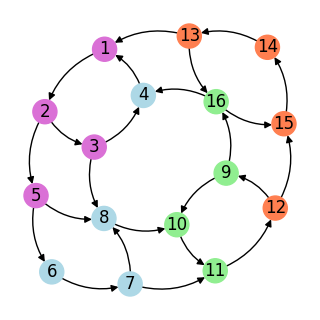
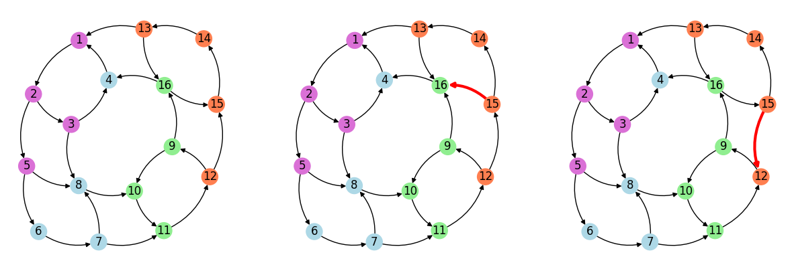
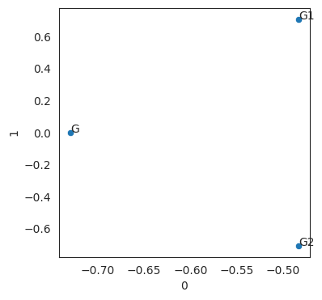
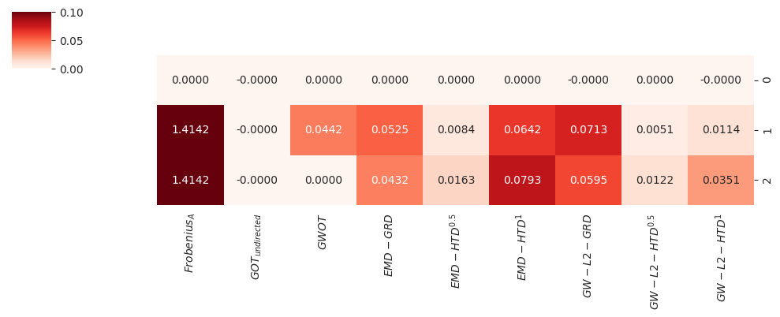

```python
import networkx as nx
import scipy.linalg as slg
import matplotlib.pyplot as plt
import numpy as np
import pandas as pd
import numpy.linalg as lg
from sklearn import preprocessing
from sklearn.manifold import MDS
import seaborn as sns
import scipy as sp
from pydiffmap import diffusion_map 
import random
sns.set_style('white')
from sklearn.preprocessing import Normalizer
random.seed(8579)
import ot
import copy
from scaccordion import tl as actl
from scipy.spatial.distance import is_valid_dm
import warnings
warnings.filterwarnings("ignore")
```

### Creating the synthetic network


```python
g1 = actl.datasets.make_gl_ciclic_graph()
nodecolors=['orchid']*4+['lightblue']*4+['lightgreen']*4 + ['coral']*4
plt.figure(figsize=(3,3))
lay=nx.nx_agraph.pygraphviz_layout(g1)
nx.draw(g1, 
        pos=lay,
        with_labels=True,
        edge_color=list(nx.get_edge_attributes(g1,'color').values()),
    connectionstyle="arc3,rad=0.25",node_color=nodecolors)
```


​    

​    


### Adding the Local and Global perturbations


```python
g2 = g1.copy()
g3 = g1.copy()
g2.remove_edge(12,15)
g2.add_edge(15,12,color='red',width=3)
g3.remove_edge(16,15)
g3.add_edge(15,16,color='red',width=3)
```


```python
aux1 = g2
g2 = g3
g3 = aux1
```


```python
_,ax2 = plt.subplots(1,3,figsize=(15,5),dpi=100)
lay=nx.nx_agraph.pygraphviz_layout(g1)
ax2 = ax2.ravel()
nx.draw(g1, 
        pos=lay,
        with_labels=True,ax=ax2[0],
        edge_color=list(nx.get_edge_attributes(g1,'color').values()),
    connectionstyle="arc3,rad=0.25",node_color=nodecolors)
nx.draw(g2, pos=lay,with_labels=True,ax=ax2[1],
        edge_color=list(nx.get_edge_attributes(g2,'color').values()),node_color=nodecolors,
        connectionstyle="arc3,rad=0.25",width=list(nx.get_edge_attributes(g2,'width').values()))
nx.draw(g3, pos=lay,with_labels=True,ax=ax2[2],
        edge_color=list(nx.get_edge_attributes(g3,'color').values()),node_color=nodecolors,
        connectionstyle="arc3,rad=0.25",width=list(nx.get_edge_attributes(g3,'width').values()))
plt.savefig("ICASSP_example_fig1.pdf")
```



    


#### Computing the first baseline: The Frobenius norm between the adjacency matrices


```python
l2c0 = np.linalg.norm(nx.to_numpy_matrix(g1) - nx.to_numpy_matrix(g1))
l2c1 = np.linalg.norm(nx.to_numpy_matrix(g1) - nx.to_numpy_matrix(g2))
l2c2 = np.linalg.norm(nx.to_numpy_matrix(g1) - nx.to_numpy_matrix(g3))
print('$Frobenius_norm(A_{1}-A_{2})$:'+f'{round(l2c1,3)}')
print('$Frobenius_norm(A_{1}-A_{2})$:'+f'{round(l2c2,3)}')

```

    $Frobenius_norm(A_{1}-A_{2})$:1.414
    $Frobenius_norm(A_{1}-A_{2})$:1.414


#### Creating the ACCorDiON object with graphs


```python
synthetic = {}
synthetic["G"] = nx.to_pandas_edgelist(g1).iloc[:,0:2]
synthetic["G"].columns = ['source','target']
synthetic["G"]['lr_means']=np.ones(len(synthetic['G'].index))
synthetic["G"]['source']=synthetic["G"]['source'].astype('str')
synthetic["G"]['target'] = synthetic["G"]['target'].astype('str')

synthetic["G1"] = nx.to_pandas_edgelist(g2).iloc[:,0:2]
synthetic["G1"].columns = ['source','target']
synthetic["G1"]['lr_means']=np.ones(len(synthetic['G1'].index))
synthetic["G1"]['source']=synthetic["G1"]['source'].astype('str')
synthetic["G1"]['target'] = synthetic["G1"]['target'].astype('str')

synthetic["G2"] = nx.to_pandas_edgelist(g3).iloc[:,0:2]
synthetic["G2"].columns = ['source','target']
synthetic["G2"]['lr_means']=np.ones(len(synthetic['G2'].index))
synthetic["G2"]['source']=synthetic["G2"]['source'].astype('str')
synthetic["G2"]['target'] = synthetic["G2"]['target'].astype('str')
```

### Making a PCA using the edgelist of the graphs


```python
Syn = actl.Accordion(tbls=synthetic,filter=0.0,weight='lr_means')
plt.figure(figsize=(4,4))
Syn.make_pca()
sns.scatterplot(x=0,y=1,data=Syn.Cs['PCA'])
for i in range(Syn.Cs['PCA'].shape[0]):
    plt.text(x=Syn.Cs['PCA'].iloc[i,0],
             y=Syn.Cs['PCA'].iloc[i,1],
             s=Syn.Cs['PCA'].index.tolist()[i])
```



    


### Computing the EMD using the directed weighted graph based distances


```python
Syn.compute_cost(mode='GRD')
Syn.compute_cost(mode='HTD')
Syn.compute_cost(mode='HTD',beta=1)
fro1=[l2c0,l2c1,l2c2]
mg1 = nx.to_numpy_array(g1)
mg2 = nx.to_numpy_array(g2)
mg3 = nx.to_numpy_array(g3)

n=len(g1.nodes())
mA =(1/n) *np.ones(n)
gwot0 = actl.GWOT.emd2RTLB(mg1,mg1,mA,mA)
gwot = actl.GWOT.emd2RTLB(mg1,mg2,mA,mA)
gwot1 = actl.GWOT.emd2RTLB(mg1,mg3,mA,mA)

lgwot=[gwot0[0],gwot[0],gwot1[0]]
ug1 = nx.to_undirected(g1)
ug2 = nx.to_undirected(g2)
ug3 = nx.to_undirected(g3)
lug1 = nx.laplacian_matrix(ug1)
lug2 = nx.laplacian_matrix(ug2)
lug3 = nx.laplacian_matrix(ug3)

ugot =[actl.GOT.wass_dist_(lug1.todense(),lug1.todense()),
       actl.GOT.wass_dist_(lug1.todense(),lug2.todense()), 
       actl.GOT.wass_dist_(lug1.todense(),lug3.todense())]

```

    pre-EMD-time:0.0019864042599995932 minutes
    post-EMD-time:7.700920104980468e-06 minutes
    pre-EMD-time:0.0010601282119750977 minutes
    post-EMD-time:3.540515899658203e-06 minutes
    pre-EMD-time:0.000931258996327718 minutes
    post-EMD-time:3.2862027486165364e-06 minutes


```python
tmp = pd.DataFrame(Syn.Cs['GRD'],index=Syn.expgraph.nodes)
```


```python
tmp.columns = Syn.expgraph.nodes
```


```python
#Syn.Cs['GRD'][np.isnan(Syn.Cs['GRD'])]=np.nanmax(Syn.Cs['GRD'])
Syn.compute_wassestein()
Syn.compute_wassestein(cost='HTD_0.5')
Syn.compute_wassestein(cost='HTD_1')

```

    100%|███████████████████████████████████████████| 3/3 [00:00<00:00, 1592.77it/s]
    100%|███████████████████████████████████████████| 3/3 [00:00<00:00, 1931.67it/s]
    100%|███████████████████████████████████████████| 3/3 [00:00<00:00, 1804.78it/s]


```python
g1m = nx.to_pandas_adjacency(g1).apply(lambda x:x/(sum(x)+1e-10),axis=1).to_numpy()
g2m = nx.to_pandas_adjacency(g2).apply(lambda x:x/(sum(x)+1e-10),axis=1).to_numpy()
g3m = nx.to_pandas_adjacency(g3).apply(lambda x:x/(sum(x)+1e-10),axis=1).to_numpy()
```


```python
ng1m = nx.from_numpy_matrix(g1m,create_using=nx.DiGraph)
ng2m = nx.from_numpy_matrix(g2m,create_using=nx.DiGraph)
ng3m = nx.from_numpy_matrix(g3m,create_using=nx.DiGraph)
```


```python
ctdg = actl.distances.ctd_dist(g1)
ctdg1 = actl.distances.ctd_dist(g2)
ctdg2 = actl.distances.ctd_dist(g3)

```


```python
gwgrd=[ot.gromov_wasserstein2(C1=ctdg,
                       C2=ctdg,
                       p=ot.unif(n=ctdg.shape[0]),
                       q=ot.unif(n=ctdg.shape[0]),
                       loss_fun='square_loss'),
ot.gromov_wasserstein2(C1=ctdg,
                       C2=ctdg1,
                       p=ot.unif(n=ctdg.shape[0]),
                       q=ot.unif(n=ctdg.shape[0]),
                       loss_fun='square_loss'),
ot.gromov_wasserstein2(C1=ctdg,
                       C2=ctdg2,
                       p=ot.unif(n=ctdg.shape[0]),
                       q=ot.unif(n=ctdg.shape[0]),
                       loss_fun='square_loss')]
```


```python
ctdg = actl.distances.get_dhp(g1m)
ctdg1 = actl.distances.get_dhp(g2m)
ctdg2 = actl.distances.get_dhp(g3m)
gwhtd05=[ot.gromov_wasserstein2(C1=ctdg,
                       C2=ctdg,
                       p=ot.unif(n=ctdg.shape[0]),
                       q=ot.unif(n=ctdg.shape[0]),
                       loss_fun='square_loss'),
ot.gromov_wasserstein2(C1=ctdg,
                       C2=ctdg1,
                       p=ot.unif(n=ctdg.shape[0]),
                       q=ot.unif(n=ctdg.shape[0]),
                       loss_fun='square_loss'),
ot.gromov_wasserstein2(C1=ctdg,
                       C2=ctdg2,
                       p=ot.unif(n=ctdg.shape[0]),
                       q=ot.unif(n=ctdg.shape[0]),
                       loss_fun='square_loss')]
ctdg = actl.distances.get_dhp(g1m,beta=1)
ctdg1 = actl.distances.get_dhp(g2m,beta=1)
ctdg2 = actl.distances.get_dhp(g3m,beta=1)

gwhtd1=[ot.gromov_wasserstein2(C1=ctdg,
                       C2=ctdg,
                       p=ot.unif(n=ctdg.shape[0]),
                       q=ot.unif(n=ctdg.shape[0]),
                       loss_fun='square_loss'),
ot.gromov_wasserstein2(C1=ctdg,
                       C2=ctdg1,
                       p=ot.unif(n=ctdg.shape[0]),
                       q=ot.unif(n=ctdg.shape[0]),
                       loss_fun='square_loss'),
ot.gromov_wasserstein2(C1=ctdg,
                       C2=ctdg2,
                       p=ot.unif(n=ctdg.shape[0]),
                       q=ot.unif(n=ctdg.shape[0]),
                       loss_fun='square_loss')]
```


```python
ctdg = actl.distances.get_dhp(g1m,beta=1)
ctdg1 = actl.distances.get_dhp(g2m,beta=1)
ctdg2 = actl.distances.get_dhp(g3m,beta=1)

```


```python
 distfrG = pd.DataFrame.from_dict({
                        '$Frobenius_{A}$':fro1,
                        "$GOT_{undirected}$":ugot,
                        "$GWOT$":lgwot,
                        '$EMD-GRD$':Syn.wdist['GRD']['G'].tolist(),
                        '$EMD-HTD^{0.5}$':Syn.wdist['HTD_0.5']['G'].tolist(),
                        '$EMD-HTD^{1}$':Syn.wdist['HTD_1']['G'].tolist(),
                        '$GW-L2-GRD$':gwgrd,
                        '$GW-L2-HTD^{0.5}$':gwhtd05,
                        '$GW-L2-HTD^{1}$':gwhtd1,})
sns.clustermap(distfrG,
               cmap='Reds',
               annot=True, 
               fmt=".4f",
               row_cluster=False,figsize=(10,4),col_cluster=False,vmin=0,vmax=0.1)
```


    <seaborn.matrix.ClusterGrid at 0x7faa450883d0>



    

