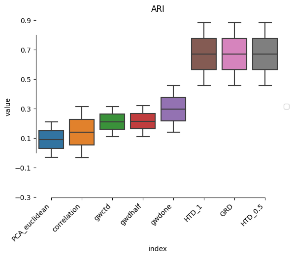

```python
import scaccordion.tl as actl
import seaborn as sns
import skimpy as skm
import numpy as np
import pandas as pd
import pickle
import sklearn
from sklearn import covariance
import os
import networkx as nx
from scipy.sparse import diags
from scipy.linalg import  norm
from scipy.sparse.linalg import eigsh
from sklearn.preprocessing import Normalizer
from sklearn import manifold
import matplotlib.pyplot as plt
import ot
selected = ['myocardial_infarction_processed',
            'Peng_PDAC_processed']
res =[]
path = "/home/james/icg/scRNA/Patients_scRNA/ctkerout/"
out = "/home/james/icg/scRNA/Patients_scRNA/ICASSP/"
ver = True #i.find('PDAC') >=0:
accobj = {}
import warnings
warnings.filterwarnings("ignore")
```


```python
for i in os.listdir(path):
        if  i in selected:
            print(f"\n\nDataset:{i}\n\n")
            currfile=path+i+'/LR_data_final.Rds'
            data = actl.utils.parse_CrossTalkeR(currfile)
            dtset = i.replace('_processed','')
            metadata = pd.read_hdf(f"/home/james/icg/scRNA/Patients_scRNA/data/metadata/{dtset}_metaacc.h5ad")
            data = {ik:data[ik] for ik in data.keys()  if ik.find("_x_") < 0 }
            data ={ik:data[ik] for ik in data.keys() if ik in list(metadata.index)}
            Aaccdt = actl.Accordion(tbls=data,weight='lr_means', filter=0.2)
            Aaccdt.make_pca()
            Aaccdt.compute_cost(mode='distance',metric='correlation')
            Aaccdt.compute_cost('GRD')
            Aaccdt.compute_cost('HTD')
            Aaccdt.compute_cost('HTD',beta=1)
            Aaccdt.compute_cost(mode='distancePCA',metric='euclidean')
            A = nx.adjacency_matrix(Aaccdt.expgraph).todense()
            print('\n\nCost Computed with success\n\n')
            Aaccdt.compute_wassestein(cost='GRD')
            Aaccdt.compute_wassestein(cost='correlation')
            Aaccdt.compute_wassestein(cost='HTD_0.5')
            Aaccdt.compute_wassestein(cost='HTD_1')
            tmpout = out+i
            #with open(f"{tmpout}_data.pickle","wb") as dt:
            #        pickle.dump(Aaccdt,dt)
            accobj[i]=Aaccdt
   
```


​    
    Dataset:Peng_PDAC_processed


​    
​    
​    
    Cost Computed with success


​    


    100%|███████████████████████████████████████████| 35/35 [00:00<00:00, 64.30it/s]
    100%|███████████████████████████████████████████| 35/35 [00:00<00:00, 73.13it/s]
    100%|███████████████████████████████████████████| 35/35 [00:00<00:00, 79.39it/s]
    100%|███████████████████████████████████████████| 35/35 [00:00<00:00, 70.68it/s]


​    
​    
    Dataset:myocardial_infarction_processed


​    
​    
​    
    Cost Computed with success


​    


    100%|███████████████████████████████████████████| 20/20 [00:08<00:00,  2.29it/s]
    100%|███████████████████████████████████████████| 20/20 [00:13<00:00,  1.48it/s]
    100%|███████████████████████████████████████████| 20/20 [00:10<00:00,  1.88it/s]
    100%|███████████████████████████████████████████| 20/20 [00:11<00:00,  1.70it/s]


```python
for dt in os.listdir(path):
    if dt in selected:# and dt in selected: 
        print(dt)
        #f = open(path+dt,'rb')
        dtset = dt.replace('_processed','').replace('.pickle','').replace('_data','')
        metadata = pd.read_hdf(f"/home/james/icg/scRNA/Patients_scRNA/data/metadata/{dtset}_metaacc.h5ad")
        Aaccdt = accobj[dt]
        gwdist ={}
        gwdistd1 ={}
        gwdistd2 ={}
        eset = [tuple(i.split('$')) for i in Aaccdt.p.index]
        for i in Aaccdt.graphs.keys():
                gwdist[i] ={}
                gwdistd1[i] ={}
                gwdistd2[i] ={}
                for j in Aaccdt.graphs.keys():
                    if i != j:
                        p1 = np.ones(len(Aaccdt.graphs[i].nodes()))/len(Aaccdt.graphs[i].nodes())
                        q1 = np.ones(len(Aaccdt.graphs[j].nodes()))/len(Aaccdt.graphs[j].nodes())
                        tmpc1 = nx.to_numpy_array(Aaccdt.graphs[i],weight='lr_means')
                        for idx in range(tmpc1.shape[0]):
                            if sum(tmpc1[idx,:]) != 0: 
                                tmpc1[idx,:] = tmpc1[idx,:]/tmpc1[idx,:].sum()
                            if sum(tmpc1[idx,:] == 1.0) > 0:
                                tmpc1[idx,:][tmpc1[idx,:] == 1] = 0
                        tmpc2 = nx.to_numpy_array(Aaccdt.graphs[j],weight='lr_means')
                        for idx in range(tmpc2.shape[0]):
                            if sum(tmpc2[idx,:]) != 0: 
                                tmpc2[idx,:] = tmpc2[idx,:]/tmpc2[idx,:].sum()
                            if sum(tmpc2[idx,:] == 1.0) > 0:
                                tmpc2[idx,:][tmpc2[idx,:] == 1] = 0
                        c1_half = actl.distances.get_dhp(tmpc1)
                        c2_half = actl.distances.get_dhp(tmpc2)
                        c1_one = actl.distances.get_dhp(tmpc1,beta=1)
                        c2_one = actl.distances.get_dhp(tmpc2,beta=1)
                        gwdistd1[i][j]=ot.gromov.gromov_wasserstein2(C1=c1_one,
                                             C2=c2_one,
                                             p=p1,
                                             q=q1,
                                             loss_fun='square_loss')
                        gwdistd2[i][j]=ot.gromov.gromov_wasserstein2(C1=c1_half,
                                              C2=c2_half,
                                              p=p1,
                                              q=q1,
                                              loss_fun='square_loss')
                        tmpc1 = nx.from_numpy_matrix(tmpc1,create_using=nx.DiGraph)
                        tmpc1 = nx.relabel_nodes(tmpc1,{i[0]:i[1] for i in enumerate(Aaccdt.graphs[i])})
                        tmpc2 = nx.from_numpy_matrix(tmpc2,create_using=nx.DiGraph)
                        tmpc2 = nx.relabel_nodes(tmpc2,{i[0]:i[1] for i in enumerate(Aaccdt.graphs[j])})
                        c1 = actl.distances.ctd_dist(tmpc1)
                        c2 = actl.distances.ctd_dist(tmpc2)
                        gwdist[i][j]=ot.gromov.gromov_wasserstein2(C1=c1,
                                                          C2=c2,
                                                          p=p1,
                                                          q=q1,
                                                          loss_fun='square_loss')                
        gwctd = pd.DataFrame.from_dict(gwdist)
        Aaccdt.wdist['gwctd']=np.round(gwctd.loc[Aaccdt.p.columns,Aaccdt.p.columns].fillna(0),5)
        gwdistd1 = pd.DataFrame.from_dict(gwdistd1)
        X_max = np.nanmax(gwdistd1[gwdistd1 != np.inf])
        gwdistd1[gwdistd1 > X_max] = X_max
        Aaccdt.wdist['gwdone']=np.round(gwdistd1.loc[Aaccdt.p.columns,Aaccdt.p.columns].fillna(0),5)
        gwdistd2 = pd.DataFrame.from_dict(gwdistd2)
        X_max = np.nanmax(gwdistd2[gwdistd2 != np.inf])
        gwdistd2[gwdistd2 > X_max] = X_max
        Aaccdt.wdist['gwdhalf']=np.round(gwdistd2.loc[Aaccdt.p.columns,Aaccdt.p.columns].fillna(0),5)
        tmp=Aaccdt.eval_all(y=metadata.loc[Aaccdt.p.columns,'accLabel'])
        tmp = pd.DataFrame.from_dict(tmp,orient="index")
        tmp['dataset'] = dt
        res.append(tmp)
        #tmp.to_pickle(f"out/{dt}")
        #with open(f"out/{dt}","wb") as dt:
        #            pickle.dump(Aaccdt,dt)
```

    Peng_PDAC_processed
    myocardial_infarction_processed


```python
tmp = pd.concat(res).reset_index()
evaldt = tmp.loc[:,['index','ARS','dataset']]
evaldt = evaldt.pivot(index='index',columns='dataset').T.reset_index().drop(columns='level_0')
evaldt = evaldt.set_index('dataset').iloc[:,np.argsort(evaldt.set_index('dataset').mean())].reset_index()
evaldt=evaldt.melt(id_vars='dataset')
sns.boxplot(x="index",y='value',data=evaldt)
sns.despine(offset=0.2, trim=True)
plt.xticks(rotation=45, ha='right')
plt.title("ARI")
plt.legend(loc='center left', bbox_to_anchor=(1, 0.5))
plt.yticks(np.arange(-0.3,1,0.2))
plt.show()
#evaldt=evaldt.reset_index().drop(columns='level_0').melt(id_vars='dataset')
```

    No artists with labels found to put in legend.  Note that artists whose label start with an underscore are ignored when legend() is called with no argument.



    


```python
tmp = pd.concat(res).reset_index()
evaldt = tmp.loc[:,['index','ARS','dataset']]
```


```python
evaldt
```


<div>
<style scoped>
    .dataframe tbody tr th:only-of-type {
        vertical-align: middle;
    }

    .dataframe tbody tr th {
        vertical-align: top;
    }
    
    .dataframe thead th {
        text-align: right;
    }
</style>
<table border="1" class="dataframe">
  <thead>
    <tr style="text-align: right;">
      <th></th>
      <th>index</th>
      <th>ARS</th>
      <th>dataset</th>
    </tr>
  </thead>
  <tbody>
    <tr>
      <th>0</th>
      <td>PCA_euclidean</td>
      <td>-0.027599</td>
      <td>Peng_PDAC_processed</td>
    </tr>
    <tr>
      <th>1</th>
      <td>GRD</td>
      <td>0.884777</td>
      <td>Peng_PDAC_processed</td>
    </tr>
    <tr>
      <th>2</th>
      <td>correlation</td>
      <td>-0.033237</td>
      <td>Peng_PDAC_processed</td>
    </tr>
    <tr>
      <th>3</th>
      <td>HTD_0.5</td>
      <td>0.884777</td>
      <td>Peng_PDAC_processed</td>
    </tr>
    <tr>
      <th>4</th>
      <td>HTD_1</td>
      <td>0.884777</td>
      <td>Peng_PDAC_processed</td>
    </tr>
    <tr>
      <th>5</th>
      <td>gwctd</td>
      <td>0.109974</td>
      <td>Peng_PDAC_processed</td>
    </tr>
    <tr>
      <th>6</th>
      <td>gwdone</td>
      <td>0.138969</td>
      <td>Peng_PDAC_processed</td>
    </tr>
    <tr>
      <th>7</th>
      <td>gwdhalf</td>
      <td>0.109974</td>
      <td>Peng_PDAC_processed</td>
    </tr>
    <tr>
      <th>8</th>
      <td>PCA_euclidean</td>
      <td>0.210876</td>
      <td>myocardial_infarction_processed</td>
    </tr>
    <tr>
      <th>9</th>
      <td>GRD</td>
      <td>0.455679</td>
      <td>myocardial_infarction_processed</td>
    </tr>
    <tr>
      <th>10</th>
      <td>correlation</td>
      <td>0.312917</td>
      <td>myocardial_infarction_processed</td>
    </tr>
    <tr>
      <th>11</th>
      <td>HTD_0.5</td>
      <td>0.455679</td>
      <td>myocardial_infarction_processed</td>
    </tr>
    <tr>
      <th>12</th>
      <td>HTD_1</td>
      <td>0.455679</td>
      <td>myocardial_infarction_processed</td>
    </tr>
    <tr>
      <th>13</th>
      <td>gwctd</td>
      <td>0.312917</td>
      <td>myocardial_infarction_processed</td>
    </tr>
    <tr>
      <th>14</th>
      <td>gwdone</td>
      <td>0.455679</td>
      <td>myocardial_infarction_processed</td>
    </tr>
    <tr>
      <th>15</th>
      <td>gwdhalf</td>
      <td>0.320291</td>
      <td>myocardial_infarction_processed</td>
    </tr>
  </tbody>
</table>
</div>

